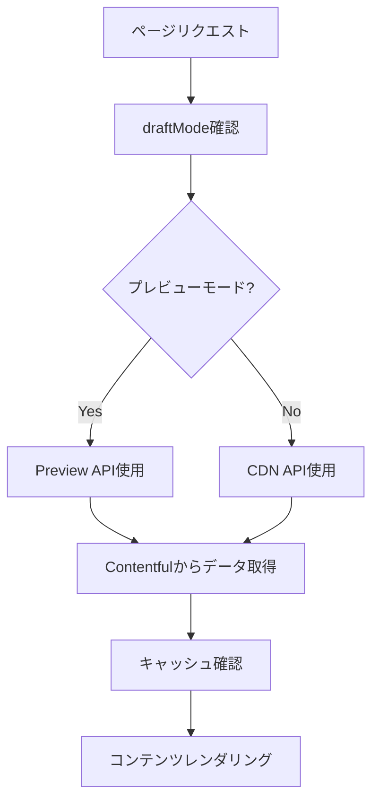

# Contentful + Next.js プロジェクト設計書

## 概要

このドキュメントは、Contentful CMSとNext.js 14を使用したビジネススキル百科サイトの設計、技術要件、コードの特徴、サイト構造を包括的にまとめたものです。他のリポジトリでの実装や参考資料として活用できます。

## 🏗️ プロジェクト構造

### ディレクトリ構成

```
project-root/
├── src/
│   ├── app/                    # Next.js App Router
│   │   ├── api/               # API Routes
│   │   │   ├── contentful/    # Contentful Webhook
│   │   │   ├── preview/       # プレビュー機能
│   │   │   └── revalidate/    # 再検証API
│   │   ├── articles/          # 記事ページ
│   │   ├── videos/            # 動画ページ
│   │   ├── audios/            # 音声ページ
│   │   ├── categories/        # カテゴリページ
│   │   └── mdx-articles/      # MDX記事ページ
│   ├── components/            # Reactコンポーネント
│   │   ├── mdx/              # MDX専用コンポーネント
│   │   ├── preview/          # プレビュー機能
│   │   └── ui/               # UI基本コンポーネント
│   ├── lib/                   # ライブラリ・ユーティリティ
│   │   ├── contentful.ts     # Contentful設定
│   │   ├── api.ts            # API関数
│   │   └── types.ts          # TypeScript型定義
│   └── utils/                 # ユーティリティ関数
├── docs/                      # プロジェクトドキュメント
├── public/                    # 静的ファイル
└── scripts/                   # 運用スクリプト
```

## 🛠️ 技術スタック

### フロントエンド
- **Next.js 15.4.3** - React フレームワーク（App Router使用）
- **React 19.1.0** - UIライブラリ
- **TypeScript 5** - 型安全性
- **Tailwind CSS 3.4.1** - スタイリング
- **Lucide React** - アイコンライブラリ

### CMS・コンテンツ管理
- **Contentful 11.5.21** - ヘッドレスCMS
- **@contentful/rich-text-react-renderer** - リッチテキストレンダリング
- **next-mdx-remote 5.0.0** - MDXコンテンツ処理

### 開発・ビルドツール
- **ESLint** - コード品質管理
- **PostCSS** - CSS処理
- **Autoprefixer** - CSS自動プレフィックス

## 📊 Contentfulコンテンツモデル

### 1. Content（コンテンツ）
メインのコンテンツエンティティ

| フィールド名 | タイプ | 必須 | 説明 |
|------------|------|------|------|
| title | Short text | ✓ | コンテンツのタイトル |
| slug | Short text | ✓ | URLスラッグ（一意） |
| contentType | Short text (List) | ✓ | '記事', '動画', '音声' |
| description | Long text | - | 説明文 |
| category | Reference (多数) | ✓ | カテゴリ参照 |
| author | Reference (多数) | - | 著者参照 |
| tags | Reference (多数) | - | タグ参照 |
| body | Rich text | - | リッチテキスト本文 |
| mdxContent | Long text | - | MDX形式コンテンツ |
| videoUrl | Short text | - | 動画URL |
| audioUrl | Short text | - | 音声URL |
| featuredImage | Media | - | メイン画像 |
| thumbnail | Media | - | サムネイル |
| publishDate | Date & time | - | 公開日 |
| displayOrder | Number | - | 表示順序（0001-9999） |
| relatedContents | Reference (多数) | - | 関連コンテンツ |

### 2. Category（カテゴリ）
コンテンツ分類用

| フィールド名 | タイプ | 必須 | 説明 |
|------------|------|------|------|
| name | Short text | ✓ | カテゴリ名 |
| slug | Short text | ✓ | URLスラッグ |
| description | Long text | - | カテゴリ説明 |

### 3. Tag（タグ）
コンテンツタグ付け用

| フィールド名 | タイプ | 必須 | 説明 |
|------------|------|------|------|
| name | Short text | ✓ | タグ名 |
| slug | Short text | ✓ | URLスラッグ |

### 4. Author（著者）
コンテンツ作成者情報

| フィールド名 | タイプ | 必須 | 説明 |
|------------|------|------|------|
| name | Short text | ✓ | 著者名 |
| bio | Long text | - | 略歴 |
| profilePicture | Media | - | プロフィール画像 |

## 🔧 主要な技術実装

### Contentful設定（src/lib/contentful.ts）

```typescript
import { createClient } from 'contentful';

export const getContentfulClient = (preview = false) => {
  const { space, accessToken, previewAccessToken, environment } = contentfulConfig;

  return createClient({
    space,
    accessToken: preview ? previewAccessToken : accessToken,
    environment,
    host: preview ? 'preview.contentful.com' : 'cdn.contentful.com',
  });
};

export const contentfulClient = getContentfulClient();
export const previewContentfulClient = getContentfulClient(true);
```

### API関数（src/lib/api.ts）

```typescript
// プレビューモード対応のクライアント取得
export async function getClient() {
  try {
    const { isEnabled } = await draftMode();
    return isEnabled ? previewContentfulClient : contentfulClient;
  } catch (error) {
    return contentfulClient;
  }
}

// キャッシュ機能付きコンテンツ取得
export const getArticles = cache(async (limit = 10, skip = 0) => {
  const client = await getClient();
  
  const response = await client.getEntries({
    content_type: CONTENT_TYPE.CONTENT,
    'fields.contentType': CONTENT_TYPES.ARTICLE,
    order: '-sys.createdAt',
    limit,
    skip,
    include: 2,
  });

  return response;
});
```

### 型定義（src/lib/types.ts）

```typescript
export interface ContentFields {
  title: string;
  slug: string;
  contentType: string[];
  description?: string;
  category: Entry<CategoryFields>[];
  author?: Entry<AuthorFields>[];
  tags?: Entry<TagFields>[];
  body?: any;
  mdxContent?: string;
  videoUrl?: string;
  audioUrl?: string;
  featuredImage?: Asset;
  thumbnail?: Asset;
  publishDate?: string;
  displayOrder?: number;
  relatedContents?: Entry<ContentFields>[];
}

export type Content = Entry<ContentFields>;
export type ContentCollection = EntryCollection<ContentFields>;
```

## 🎨 主要コンポーネント

### 1. Heroカルーセル（SimpleCardCarousel）

3Dカルーセル効果を持つメインビジュアル

**特徴:**
- 自動スライド切り替え（3秒間隔）
- ホバー時一時停止
- レスポンシブデザイン
- 前後スライドの部分表示
- 背景ぼかし効果

```typescript
interface SimpleCardSlide {
  id: string;
  title: string;
  description: string;
  imageUrl: string | null;
  linkUrl: string;
  linkText: string;
  category: string;
  useGradientCard?: boolean;
  gradientClass?: string;
  iconSvg?: string;
}
```

### 2. MDXレンダリングシステム

カスタムコンポーネントを含むMDXコンテンツの処理

**対応コンポーネント:**
- `<Callout>` - 情報ボックス
- `<CodeBlock>` - シンタックスハイライト
- `<CustomImage>` - 最適化画像
- `<YellowHighlight>` - 黄色ハイライト
- `<RedText>` - 赤色テキスト
- `<LineBreak>` - 改行制御

### 3. プレビューシステム

Contentful Live Preview対応

```typescript
// プレビューAPI（src/app/api/preview/route.ts）
export async function GET(request: NextRequest) {
  const { searchParams } = new URL(request.url);
  const secret = searchParams.get('secret');
  const slug = searchParams.get('slug');
  const contentType = searchParams.get('contentType');

  // 認証とリダイレクト処理
  if (secret !== process.env.CONTENTFUL_PREVIEW_SECRET) {
    return new Response('Invalid token', { status: 401 });
  }

  draftMode().enable();
  
  const redirectUrl = getRedirectUrl(contentType, slug);
  return NextResponse.redirect(new URL(redirectUrl, request.url));
}
```

## 🔄 データフロー

### 1. コンテンツ取得フロー



### 2. Webhook再検証フロー

```mermaid
graph TD
    A[Contentful更新] --> B[Webhook送信]
    B --> C[/api/revalidate]
    C --> D[認証確認]
    D --> E[該当ページ再検証]
    E --> F[キャッシュ更新]
```

## 🎯 主要機能

### 1. コンテンツ管理
- **マルチメディア対応**: 記事、動画、音声の統合管理
- **カテゴリ分類**: 階層的なコンテンツ分類
- **タグ付け**: 横断的なコンテンツ分類
- **関連コンテンツ**: コンテンツ間の関連付け

### 2. 表示機能
- **レスポンシブデザイン**: モバイル・タブレット・デスクトップ対応
- **カルーセル表示**: 注目コンテンツの効果的な表示
- **検索機能**: 全文検索対応
- **ページネーション**: 大量コンテンツの効率的な表示

### 3. パフォーマンス最適化
- **ISR（Incremental Static Regeneration）**: 静的生成とリアルタイム更新の両立
- **画像最適化**: Next.js Image コンポーネント活用
- **キャッシュ戦略**: React cache() とContentful CDN活用
- **コード分割**: 動的インポートによる最適化

### 4. SEO・アクセシビリティ
- **メタデータ最適化**: 動的メタタグ生成
- **構造化データ**: JSON-LD対応
- **アクセシビリティ**: WCAG準拠
- **パフォーマンス**: Core Web Vitals最適化

## 🔐 セキュリティ設定

### Content Security Policy

```javascript
// next.config.js
async headers() {
  return [
    {
      source: '/(.*)',
      headers: [
        {
          key: 'Content-Security-Policy',
          value: [
            "default-src 'self'",
            "script-src 'self' 'unsafe-eval' 'unsafe-inline' https://app.contentful.com",
            "style-src 'self' 'unsafe-inline'",
            "img-src 'self' data: https: blob:",
            "connect-src 'self' https://cdn.contentful.com https://preview.contentful.com",
            "frame-ancestors 'self' https://app.contentful.com",
          ].join('; '),
        },
      ],
    },
  ];
}
```

### 環境変数

```bash
# Contentful設定
CONTENTFUL_SPACE_ID=your_space_id
CONTENTFUL_ACCESS_TOKEN=your_access_token
CONTENTFUL_PREVIEW_ACCESS_TOKEN=your_preview_token
CONTENTFUL_ENVIRONMENT=master

# プレビュー設定
CONTENTFUL_PREVIEW_SECRET=your_preview_secret

# 開発設定
NEXT_PUBLIC_USE_MOCK_DATA=false
NODE_ENV=production
```

## 🚀 デプロイメント

### Vercel設定

```json
{
  "buildCommand": "npm run build",
  "outputDirectory": ".next",
  "installCommand": "npm install",
  "framework": "nextjs",
  "functions": {
    "src/app/api/**/*.ts": {
      "maxDuration": 30
    }
  }
}
```

### Webhook設定

Contentfulで以下のWebhookを設定：

```
URL: https://your-domain.com/api/revalidate
Method: POST
Headers: 
  - x-webhook-secret: your_webhook_secret
Triggers: Entry publish, Entry unpublish, Entry delete
```

## 📈 パフォーマンス指標

### Core Web Vitals目標値
- **LCP (Largest Contentful Paint)**: < 2.5秒
- **FID (First Input Delay)**: < 100ms
- **CLS (Cumulative Layout Shift)**: < 0.1

### 最適化手法
- 画像の遅延読み込み
- フォントの最適化（Noto Sans JP）
- CSS・JSの最小化
- CDNの活用（Contentful Assets）

## 🔧 開発・運用

### 開発コマンド

```bash
# 開発サーバー起動
npm run dev

# ビルド
npm run build

# 本番サーバー起動
npm start

# リント
npm run lint
```

### デバッグ・監視

```bash
# Contentfulデータ確認
node scripts/diagnose-contentful-data.js

# Webhook テスト
node scripts/test-webhook.js

# 本番環境テスト
node scripts/test-production-webhook.js
```

## 📚 参考資料・ドキュメント

### 内部ドキュメント
- `docs/contentful-design-document.md` - Contentful設計詳細
- `docs/contentful-guidelines.md` - コンテンツ作成ガイドライン
- `docs/hero-carousel-technical-spec.md` - カルーセル技術仕様
- `docs/mdx-rendering-system-specification.md` - MDXシステム仕様

### 外部リソース
- [Next.js Documentation](https://nextjs.org/docs)
- [Contentful Documentation](https://www.contentful.com/developers/docs/)
- [Tailwind CSS Documentation](https://tailwindcss.com/docs)

## 🎯 実装のポイント

### 1. コンテンツの重複除去
displayOrderを使用したコンテンツの優先順位付けと重複除去ロジック

### 2. 画像フォールバック戦略
- Contentful画像 → Unsplash画像 → グラデーションカード の順でフォールバック

### 3. プレビュー機能
- Contentful Live Preview完全対応
- セキュリティヘッダーの適切な設定

### 4. エラーハンドリング
- Graceful degradation
- フォールバックUI
- 詳細なログ出力

この設計書を参考に、同様のContentful + Next.jsプロジェクトを構築することができます。各コンポーネントやAPIの詳細な実装は、対応するファイルを参照してください。